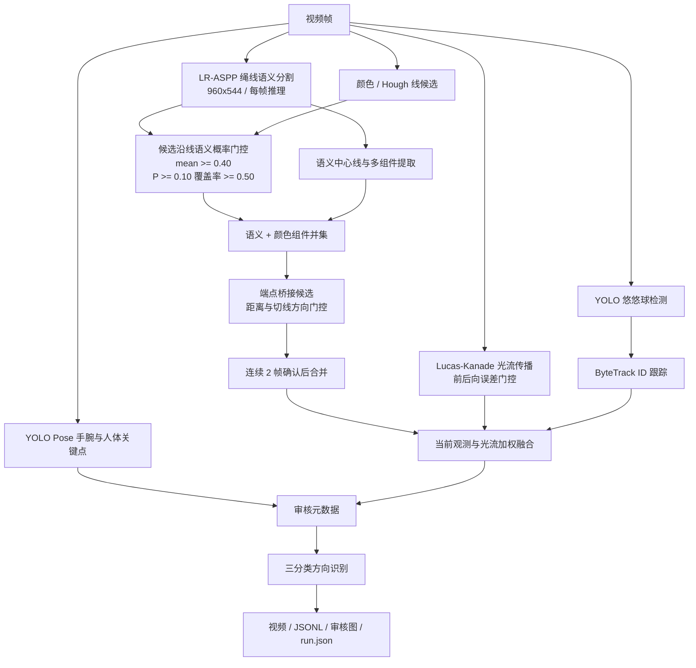
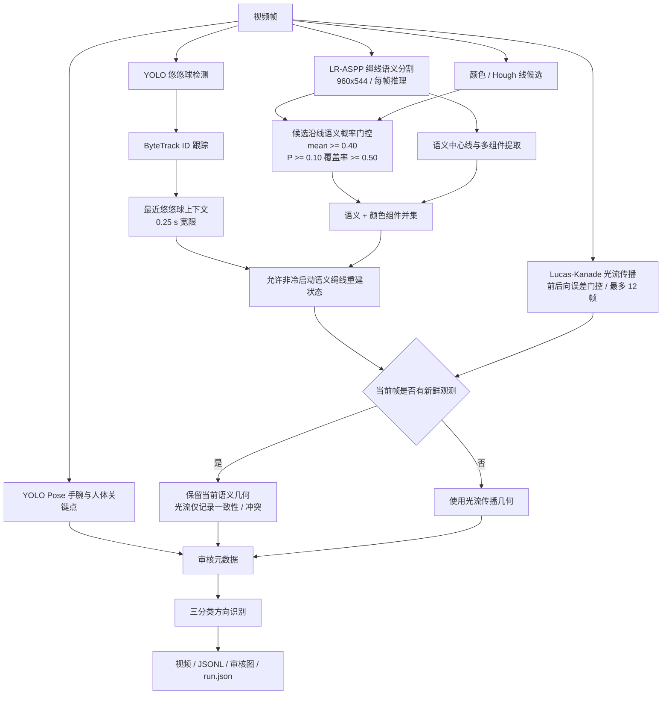
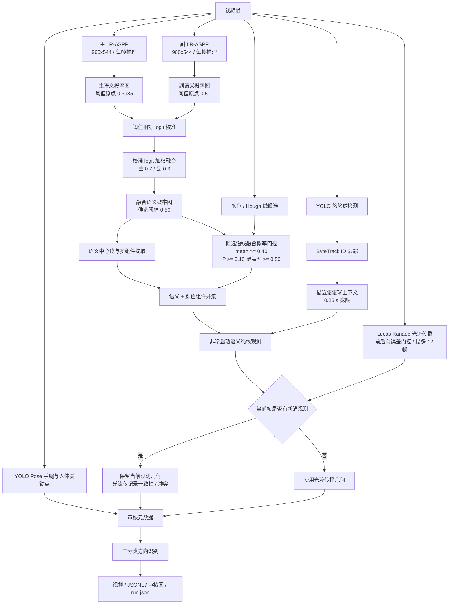
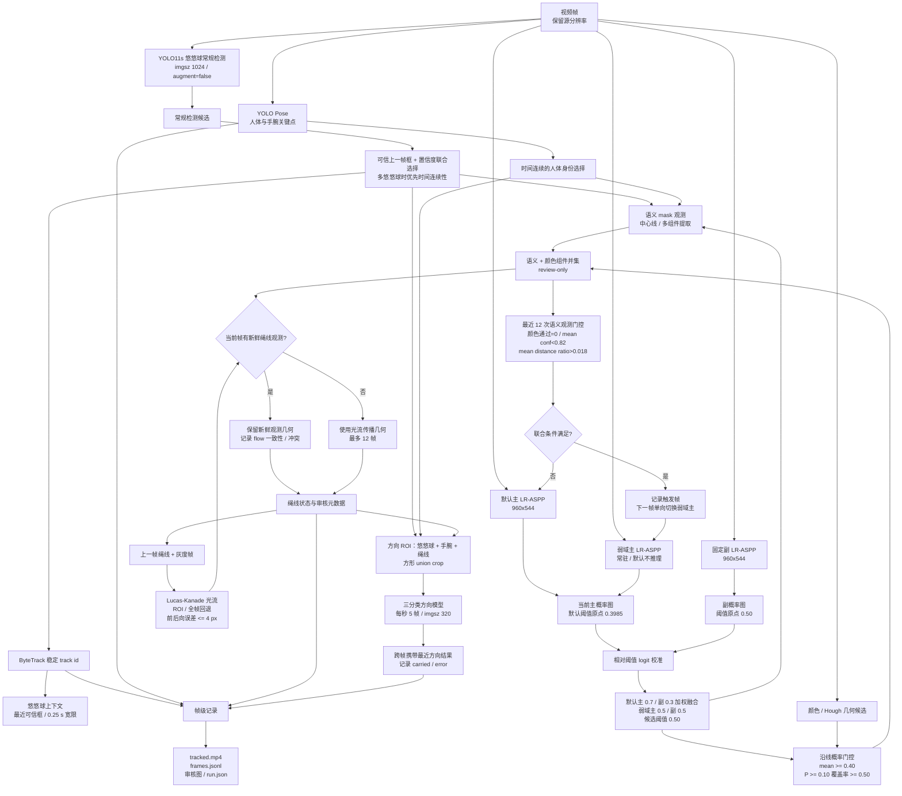
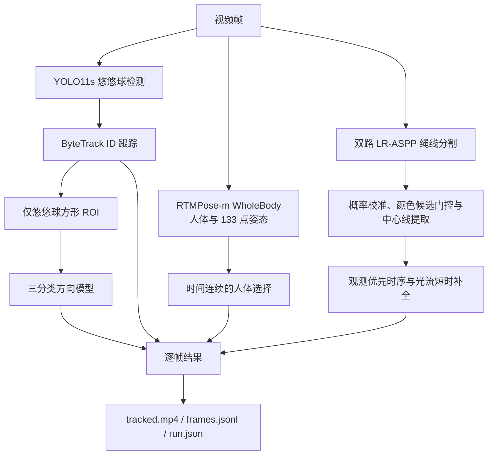
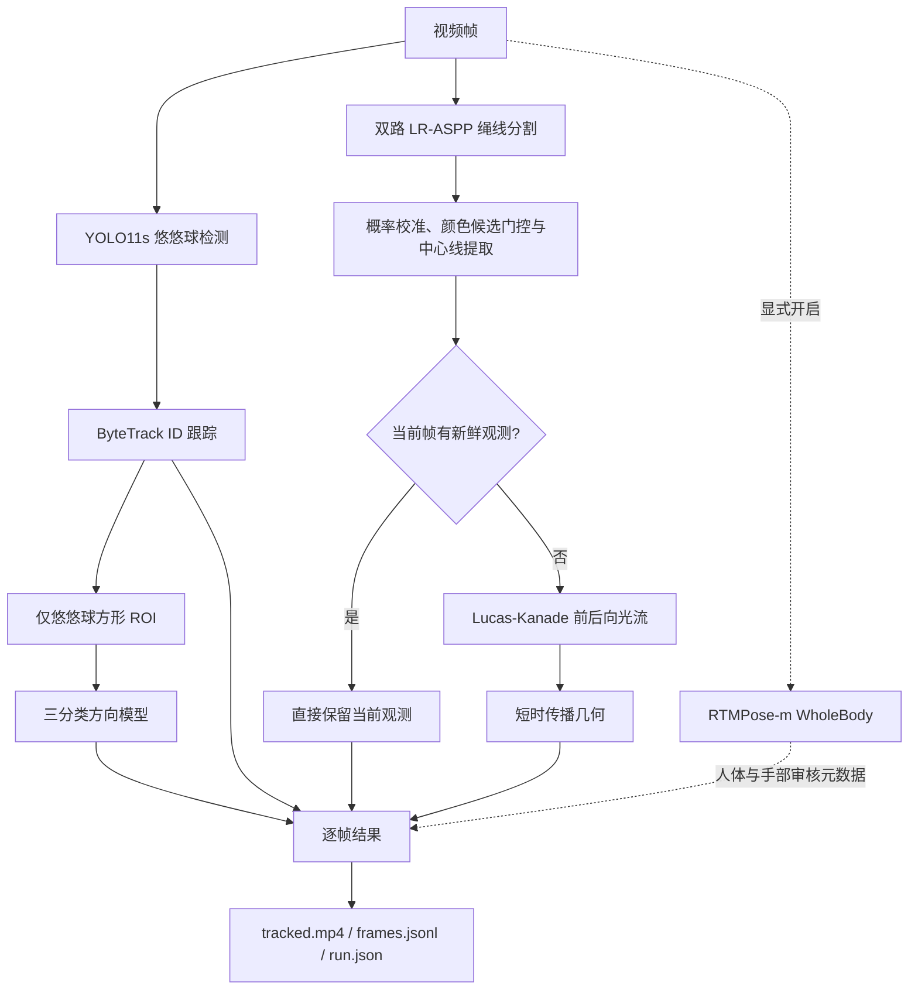

# 悠悠球识别与追踪 Pipeline

状态：持续更新，仅追加架构版本。

## 2026-08-03 版本1

## 2026-08-04 版本1

## 2026-08-04 版本2

## 2026-08-05 版本3

图中“观测优先”表示新鲜语义分割几何不会被光流结果直接形变；光流只在没有新鲜观测时作为短时补全，并记录前后向一致性与冲突元数据供审核。

## 2026-08-06 版本4

## 2026-08-07 版本5（当前默认 Pipeline）

RTMPose-m WholeBody 保留为 Workbench 和 CLI 可选审核分支，默认关闭。当前悠悠球检测、
绳线追踪和仅悠悠球 ROI 的方向分类均不依赖姿态输出。

