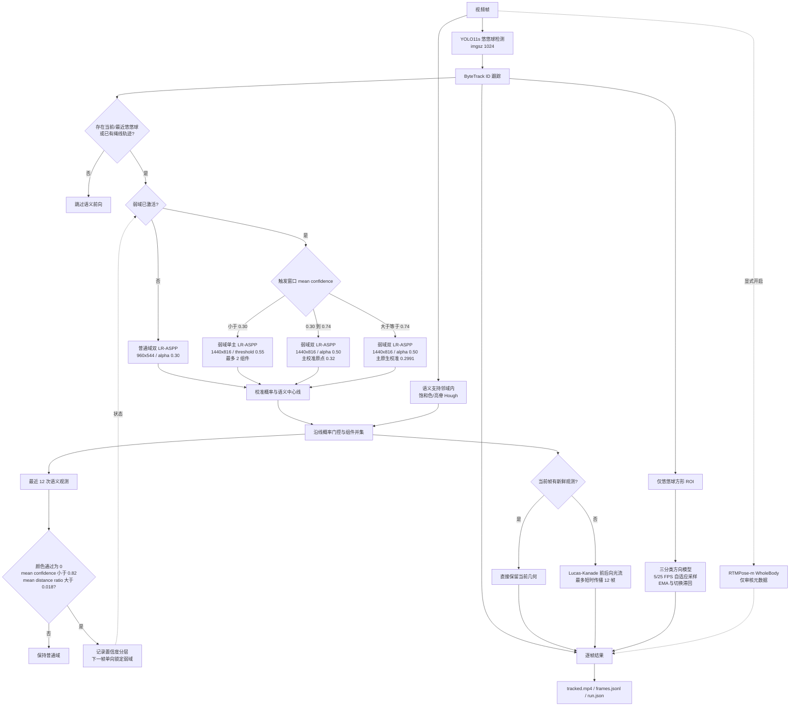

# 悠悠球识别与追踪 Pipeline

状态：2026-08-08 当前生产架构。历史实验与失效分支不在此文档保留。

```mermaid
flowchart TD
    A[视频帧] --> B[YOLO11s 悠悠球检测<br/>imgsz 1024]
    B --> C[ByteTrack ID 跟踪]

    C --> D{存在当前/最近悠悠球<br/>或已有绳线轨迹?}
    D -->|否| E[跳过语义前向]
    D -->|是| F{弱域已激活?}
    F -->|否| G[普通域双 LR-ASPP<br/>960x544 / alpha 0.30]
    F -->|是| H{触发窗口 mean confidence}
    H -->|小于 0.30| I[弱域单主 LR-ASPP<br/>1440x816 / threshold 0.55<br/>最多 2 组件]
    H -->|0.30 到 0.74| J[弱域双 LR-ASPP<br/>1440x816 / alpha 0.50<br/>主校准原点 0.32]
    H -->|大于等于 0.74| K[弱域双 LR-ASPP<br/>1440x816 / alpha 0.50<br/>主原生校准 0.2991]

    G --> L[校准概率与语义中心线]
    I --> L
    J --> L
    K --> L
    A --> M[语义支持邻域内<br/>饱和色/亮脊 Hough]
    L --> N[沿线概率门控与组件并集]
    M --> N
    N --> O[最近 12 次语义观测]
    O --> P{颜色通过为 0<br/>mean confidence 小于 0.82<br/>mean distance ratio 大于 0.018?}
    P -->|否| Q[保持普通域]
    P -->|是| R[记录置信度分层<br/>下一帧单向锁定弱域]
    R -. 状态 .-> F

    N --> S{当前帧有新鲜观测?}
    S -->|是| T[直接保留当前几何]
    S -->|否| U[Lucas-Kanade 前后向光流<br/>最多短时传播 12 帧]

    C --> V[仅悠悠球方形 ROI]
    V --> W[三分类方向模型<br/>5/25 FPS 自适应采样<br/>EMA 与切换滞回]
    A -. 显式开启 .-> X[RTMPose-m WholeBody<br/>仅审核元数据]

    C --> Y[逐帧结果]
    T --> Y
    U --> Y
    W --> Y
    X -.-> Y
    Y --> Z[tracked.mp4 / frames.jsonl / run.json]
```

弱域门控在触发帧完成统计，从下一帧生效。自适应双路预测器和 CUDA Graph 仅在确定需要双路分支后创建；超弱单主分支不会承担这部分初始化和推理开销。Workbench 默认读取 `config.yaml` 中的同一候选权重与阈值策略。
