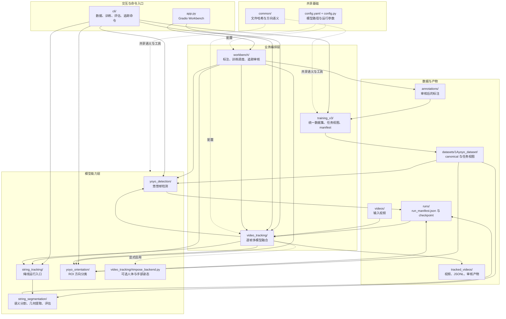
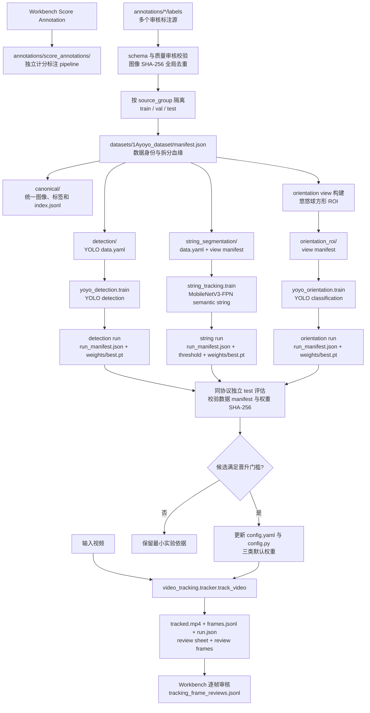
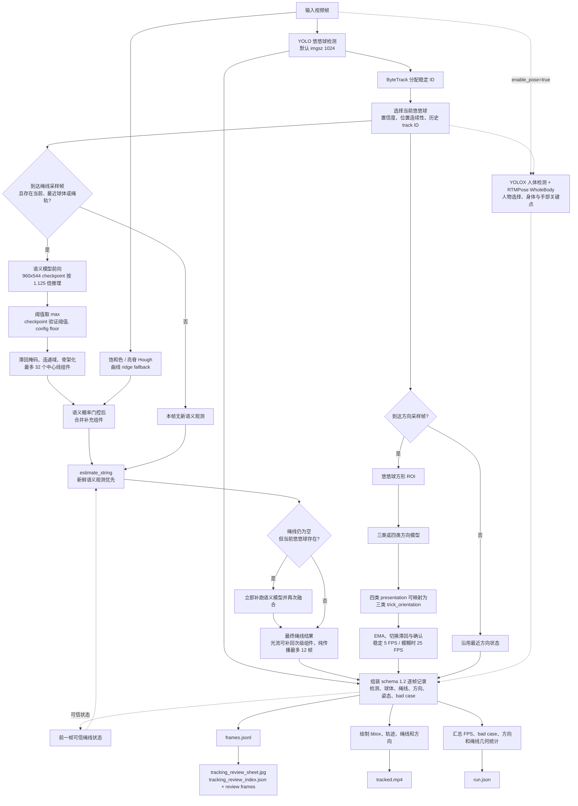

# YoYo Model 项目流程与结构

状态：2026-09-07，基于 `main` 分支提交 `cc7aeaa`。

## 项目结构图

### 目录职责

| 目录或文件 | 主要职责 |
| --- | --- |
| `app.py` | 组装标注、训练/评估、计分标注和视频追踪页签 |
| `cli/` | `python -m` 命令入口，薄封装后转发到正式模块 |
| `workbench/` | Workbench 页面后端、子进程命令编排和逐帧人工审核 |
| `training_v3/` | 构建 canonical 数据集、任务视图、来源隔离拆分和 manifest |
| `yoyo_detection/` | YOLO 悠悠球检测训练、推理和评估 |
| `string_segmentation/` | MobileNetV3-FPN 绳线分割、中心线提取和静态/连续集评估 |
| `string_tracking/` | 绳线训练、评估和运行时加载 facade |
| `yoyo_orientation/` | 悠悠球 ROI 方向分类训练、推理和评估 |
| `video_tracking/` | 检测、ByteTrack、绳线、方向、可选姿态的逐帧融合 |
| `config.yaml` / `config.py` | 独立模型权重和追踪 compositor 参数 |
| `reports/` / `tests/` | 当前有效方案、训练结论和关键链路测试 |

## 端到端流程图

`manifest.json` 是训练数据身份、来源拆分和任务视图的权威记录。每个独立训练运行再以 `run_manifest.json` 绑定数据 manifest、初始化权重、参数和最终 checkpoint；评估器据此选择对应任务并校验血缘。

## 视频逐帧追踪流程图

追踪时三类模型权重分别来自 `detection`、`string_tracking` 和 `orientation` 配置区块；`tracking` 只保存多模型编排、采样频率、时序滤波和可视化参数。RTMPose 默认关闭，仅在显式启用时补充审核元数据。

## 图表维护

目录、入口、模块依赖或配置归属变化时更新“项目结构图”；标注协议、数据视图、manifest 血缘、训练评估或模型晋升流程变化时更新“端到端流程图”；`video_tracking.tracker` 的逐帧分支、采样门控、时序状态、输出 schema 或审核产物变化时更新“视频逐帧追踪流程图”。维护时以实际代码和 `config.yaml` 为准，同步更新文档顶部日期与基线提交，检查图中的默认尺寸、阈值规则、采样频率和产物名称，并使用当前支持的 Mermaid 版本完成解析或渲染验证，最后执行 `git diff --check`。
