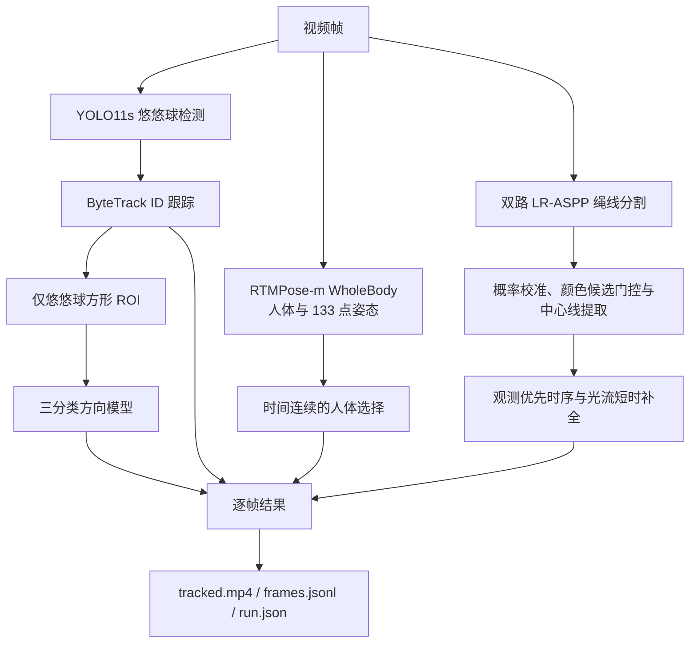

# 悠悠球识别与追踪 Pipeline

状态：2026-08-06 当前默认架构。

## 依赖边界

- RTMPose-m WholeBody 只在运行时提供人体及手部关键点，用于追踪输出和审核，不生成、补充或覆盖训练数据标注。
- 正式数据集仍为 `datasets/1Ayoyo_dataset` 和 `datasets/1Ayoyo_consecutive`，不使用 `_v3` 名称。两者 canonical 标签均不含手部或 pose 字段。
- 悠悠球检测只读取悠悠球框；绳线分割只读取绳线数据；方向分类只读取悠悠球 ROI。三个训练任务都不依赖 RTMPose 输出。
- 方向 ROI 在检测到悠悠球时使用其方框的 3 倍方形上下文；`not_applicable` 无悠悠球样本使用确定性中心裁剪。手部坐标和绳线几何均不参与裁剪。

## 模型存储

RTMPose 所有模型都存放在项目内：

- `models/rtmpose/rtmpose-m-wholebody-256x192.onnx`
- `models/rtmpose/yolox_m_8xb8-300e_humanart-c2c7a14a.onnx`

下载脚本只写入 `models/rtmpose`，运行时只加载本地 ONNX 文件，不使用 C 盘用户缓存。

## 运行参数

- 悠悠球检测：YOLO11s，`imgsz=1024`，`confidence=0.15`，`iou=0.70`。
- 绳线分割：主/副 LR-ASPP 概率融合，必要时按弱域门控切换主模型；光流最多补全 12 帧。
- 方向分类：三分类，`imgsz=320`，目标推理频率 `5 FPS`。
- RTMPose：RTMPose-m WholeBody 256x192 + YOLOX-m 人体检测器，优先 CUDA ONNX Runtime。
