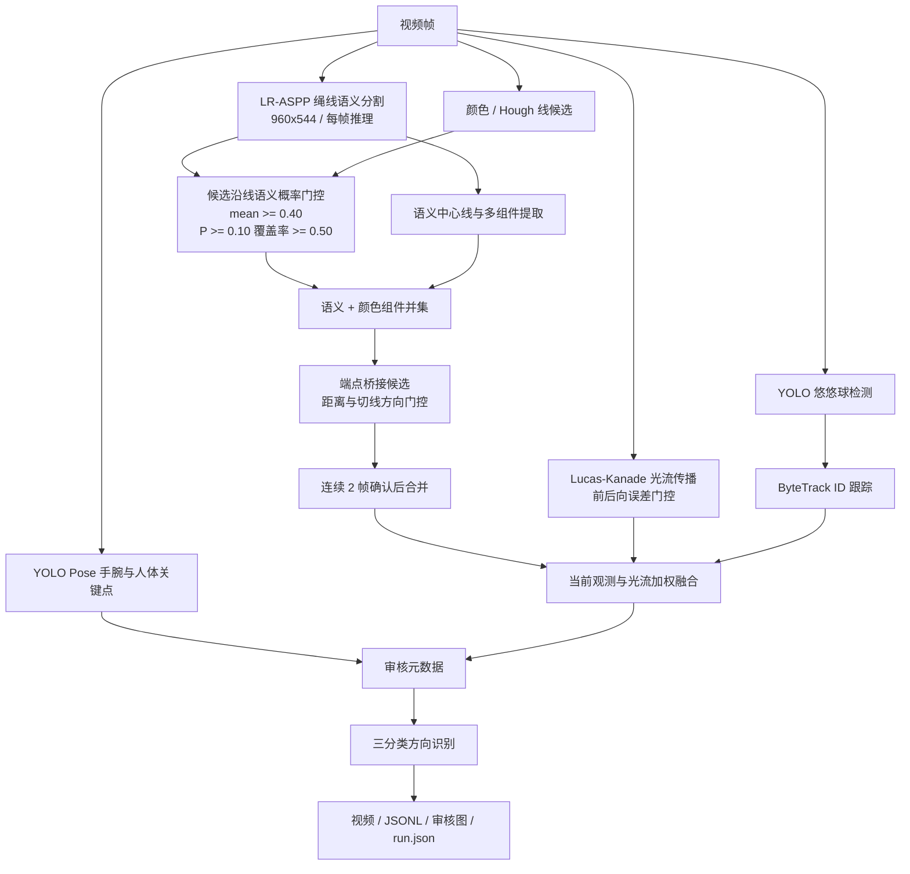
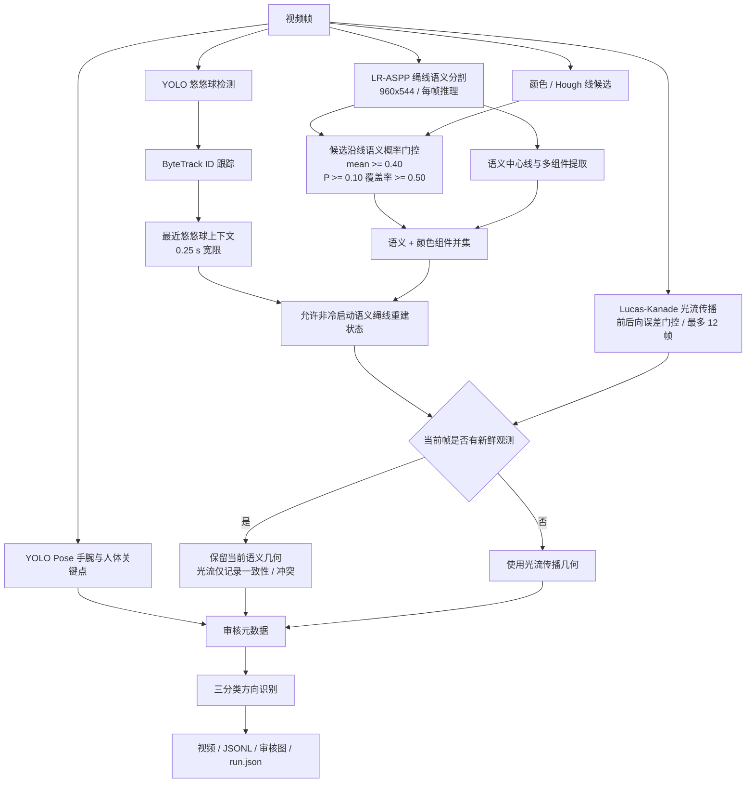
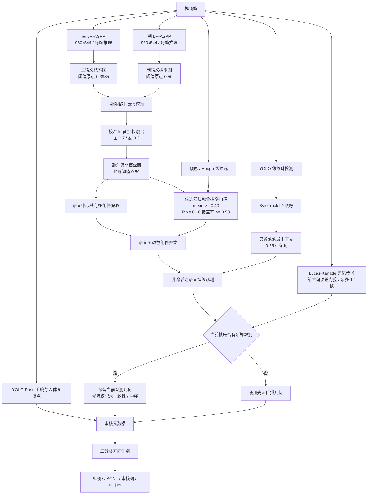

# 悠悠球识别与追踪 Pipeline

状态：持续更新，仅追加架构版本。

## 2026-08-03 版本1

```mermaid
flowchart TD
    A[视频帧] --> B[YOLO 悠悠球检测]
    B --> C[ByteTrack ID 跟踪]
    A --> D[YOLO Pose 手腕与人体关键点]
    A --> E[LR-ASPP 绳线语义分割<br/>960x544 / 每帧推理]
    E --> F[语义中心线与多组件提取]
    A --> G[颜色 / Hough 线候选]
    E --> H[候选沿线语义概率门控<br/>mean >= 0.40<br/>P >= 0.10 覆盖率 >= 0.50]
    G --> H
    H --> I[语义 + 颜色组件并集]
    F --> I
    I --> J[端点桥接候选<br/>距离与切线方向门控]
    J --> K[连续 2 帧确认后合并]
    A --> L[Lucas-Kanade 光流传播<br/>前后向误差门控]
    K --> M[当前观测与光流加权融合]
    L --> M
    C --> M
    D --> N[审核元数据]
    M --> N
    N --> O[三分类方向识别]
    O --> P[视频 / JSONL / 审核图 / run.json]
```

## 2026-08-04 版本1

```mermaid
flowchart TD
    A[视频帧] --> B[YOLO 悠悠球检测]
    B --> C[ByteTrack ID 跟踪]
    A --> D[YOLO Pose 手腕与人体关键点]
    A --> E[LR-ASPP 绳线语义分割<br/>960x544 / 每帧推理]
    E --> F[语义中心线与多组件提取]
    A --> G[颜色 / Hough 线候选]
    E --> H[候选沿线语义概率门控<br/>mean >= 0.40<br/>P >= 0.10 覆盖率 >= 0.50]
    G --> H
    H --> I[语义 + 颜色组件并集]
    F --> I
    C --> J[最近悠悠球上下文<br/>0.25 s 宽限]
    J --> K[允许非冷启动语义绳线重建状态]
    I --> K
    A --> L[Lucas-Kanade 光流传播<br/>前后向误差门控 / 最多 12 帧]
    K --> M{当前帧是否有新鲜观测}
    L --> M
    M -->|是| N[保留当前语义几何<br/>光流仅记录一致性 / 冲突]
    M -->|否| O[使用光流传播几何]
    D --> P[审核元数据]
    N --> P
    O --> P
    P --> Q[三分类方向识别]
    Q --> R[视频 / JSONL / 审核图 / run.json]
```

## 2026-08-04 版本2

```mermaid
flowchart TD
    A[视频帧] --> B[YOLO 悠悠球检测]
    B --> C[ByteTrack ID 跟踪]
    A --> D[YOLO Pose 手腕与人体关键点]
    A --> E[主 LR-ASPP<br/>960x544 / 每帧推理]
    A --> F[副 LR-ASPP<br/>960x544 / 每帧推理]
    E --> G[主语义概率图<br/>阈值原点 0.3985]
    F --> H[副语义概率图<br/>阈值原点 0.50]
    G --> I[阈值相对 logit 校准]
    H --> I
    I --> J[校准 logit 加权融合<br/>主 0.7 / 副 0.3]
    J --> K[融合语义概率图<br/>候选阈值 0.50]
    K --> L[语义中心线与多组件提取]
    A --> M[颜色 / Hough 线候选]
    K --> N[候选沿线融合概率门控<br/>mean >= 0.40<br/>P >= 0.10 覆盖率 >= 0.50]
    M --> N
    L --> O[语义 + 颜色组件并集]
    N --> O
    C --> P[最近悠悠球上下文<br/>0.25 s 宽限]
    O --> Q[非冷启动语义绳线观测]
    P --> Q
    A --> R[Lucas-Kanade 光流传播<br/>前后向误差门控 / 最多 12 帧]
    Q --> S{当前帧是否有新鲜观测}
    R --> S
    S -->|是| T[保留当前观测几何<br/>光流仅记录一致性 / 冲突]
    S -->|否| U[使用光流传播几何]
    D --> V[审核元数据]
    T --> V
    U --> V
    V --> W[三分类方向识别]
    W --> X[视频 / JSONL / 审核图 / run.json]
```
