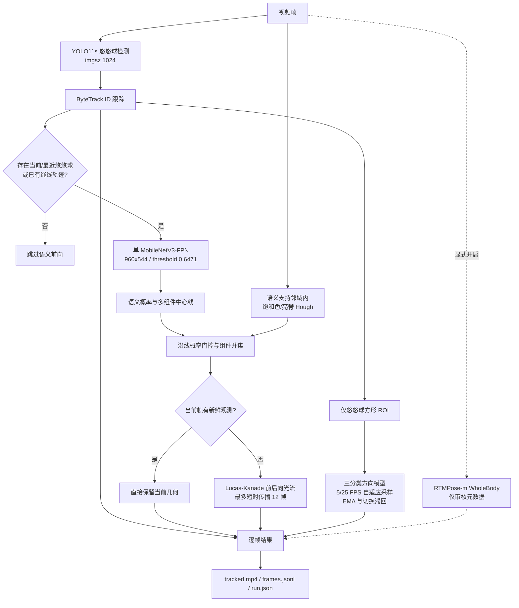

# 悠悠球识别与追踪 Pipeline

状态：2026-08-08 当前生产架构。历史实验与失效分支不在此文档保留。

FPN 融合 MobileNetV3 编码器的五个空间尺度，以一个模型替代原来的普通域双 LR-ASPP、弱域模型和分档路由。Workbench 与 CLI 默认读取 `config.yaml` 中的同一候选权重；旧 ensemble/adaptive 参数只保留为显式兼容接口，不参与默认执行。
